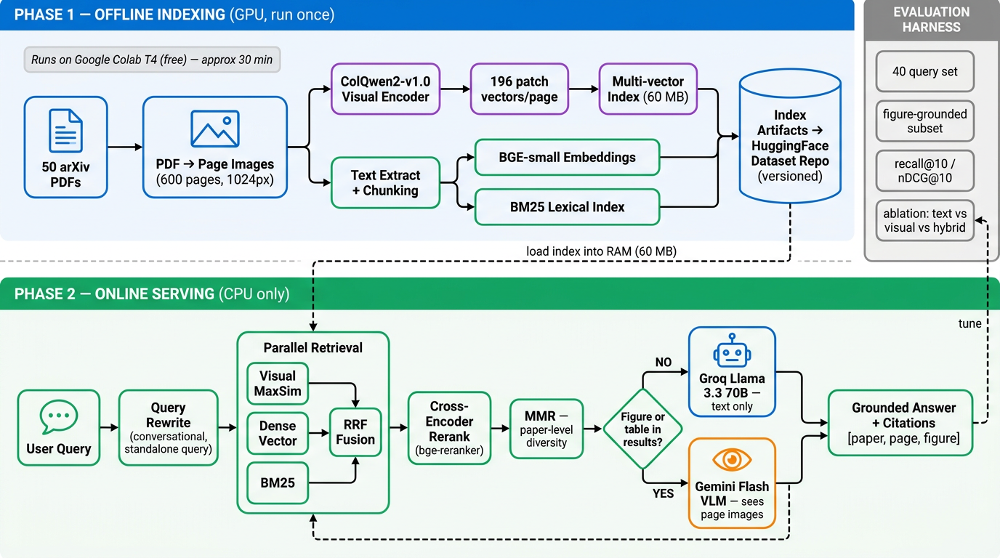

# Multimodal RAG over Visual Documents

> Retrieval-augmented generation that searches document pages **as images**, not just
> extracted text — so figures, diagrams and tables become first-class retrievable content.
>
> Runs entirely on a **4 GB consumer laptop GPU**. No vector database, no cloud inference
> for retrieval.

---

## Why

Text-only RAG silently discards the visual layer of a document. In this corpus:

- **56%** of pages contain figures or diagrams
- Pages average only **~543 characters** of extractable text
- **9 pages** have effectively no text at all — invisible to any text-based retriever

A query like *"diagram showing CPU switching between processes"* has no good answer in
the text stream. The information lives in the pixels.

This project indexes both, then fuses them.

---

## Architecture



**Two phases.** Indexing runs once on a GPU; retrieval runs on CPU in milliseconds.

```
INGESTION (offline, GPU)
  PDFs ──► page images (PyMuPDF, 150 DPI)
        │
        ├─► ColQwen2 (4-bit) ──► 176,670 patch vectors ──► visual index (45 MB)
        │
        └─► extracted text ──► chunks ──┬─► BGE-small dense vectors
                                        └─► BM25 lexical index

RETRIEVAL (online, CPU)
  query ──┬─► visual  : MaxSim over patch vectors
          ├─► dense   : cosine over chunk embeddings
          └─► bm25    : lexical scoring
                    │
                    ▼
              RRF fusion ──► per-document capping ──► ranked pages
```

---

## Results

### Index

| Metric | Value |
|---|---|
| Documents | 11 |
| Pages indexed | 234 |
| Patch vectors | 176,670 |
| Visual index size | **45.2 MB** |
| Text chunks | 247 |
| Indexing time | **4m 48s** (RTX 3050 Laptop, 4 GB) |
| Peak VRAM | **1.60 GB** |

### Query latency

| Stage | Time |
|---|---|
| ColQwen2 query encoding | ~950 ms |
| MaxSim over all pages | **~15 ms** |
| BM25 | 8 ms |
| Dense | ~5 ms |
| **Fused (end to end)** | **~1 s** |

### Fusion behaviour

Query: `"process state transition diagram"`

| Rank | Document | Page | Fig | RRF | Retriever hits |
|---|---|---|---|---|---|
| 1 | processmanagement | 2 |  | 0.0492 | `visual@1, dense@1, bm25@1` |
| 2 | processmanagement | 4 |  | 0.0471 | `visual@4, dense@5, bm25@2` |
| 3 | structures_syscalls | 21 |  | 0.0285 | `dense@19, bm25@3` |

**Rank 1** — all three retrievers independently agreed. Cross-modal consensus is the
strongest relevance signal available, and RRF amplified it to ~3× any single method.

**Rank 2** — no retriever placed it top-3 alone; agreement surfaced it. Fusion found
something none of the individual methods would have returned.

Each retriever also fails differently: BM25 ranked `structures_syscalls` p21 highly
because it contains the *words* "process state transition" — but no diagram. The visual
path correctly ignored it.

---

## Experiments

### Batch size — negligible gain 

Increasing `visual.batch_size` from 1 → 2, with correct attention-mask padding removal
(verified by byte-identical output: 176,670 vectors, 755 patches/page):

| Batch size | Time | Peak VRAM |
|---|---|---|
| 1 | 4m 48s | 1.60 GB |
| 2 | 4m 34s | ~1.9 GB |

**~5% improvement — not worth it.** Two reasons:

1. **4-bit quantization is dequantization-bound.** Every `bitsandbytes` matmul unpacks
   weights on the fly; that cost scales linearly with batch size, so there is nothing to
   amortize. Batching helps when weight-loading bandwidth dominates — it does not here.
2. **A single page is already a large batch.** At 755 patches, one image produces a
   `[1, 755, hidden]` tensor that saturates the GPU on its own.

Per-page time actually *drifted upward* during the batched run (1.03 → 1.27 s/pg) as the
laptop GPU thermally throttled.

**Reverted to `batch_size: 1`** for lower peak VRAM at effectively equal speed.

---

### Render resolution — no effect 

Rebuilt the index at 1280px / 200 DPI (verified: images are 990×1280 on disk).
Output was byte-identical to the 1024px build — 176,670 vectors, 755 patches/page.

`ColQwen2Processor` enforces a `max_pixels` token budget and downscales inputs
before patching. A 990×1280 page should yield ~1,575 patches at Qwen2-VL's 28×28
merge size; the observed 755 sits just under the processor's ~768-token cap.

**Render resolution is not the lever.** Controlling visual granularity requires
setting `max_pixels` on the processor, which doubles both index size and query cost.
Not pursued — this corpus is lecture slides with large fonts and diagrams, where
sub-1024px detail is unlikely to carry retrievable information.

remove them-
Remove-Item -Recurse -Force index\v2, data\page_images_1280

### RRF constant — `k=60` fails on a repetitive corpus 

The standard RRF constant from the original paper is `k=60`. On this corpus it
pushed correct pages out of the top 10.

**The failure case.** Query: *"diagram showing the CPU switching between two
processes"*. The gold page was ranked **#1 by both the visual and dense
retrievers**, yet did not appear in the fused top 10.

RRF scores a document as `Σ 1/(k + rank)`. At `k=60`:

```
gold page      (visual@1, dense@1)   = 1/61 + 1/61  = 0.0328
any page in all 3 lists @ rank 30    = 3/90         = 0.0333   ← wins
```

**Two rank-1 endorsements lose to three rank-30 endorsements.** The `+60` term
compresses ranks 1 and 30 to nearly equal weight, so breadth of agreement
dominates rank position entirely.

**Sweep** (5 queries, fused mode):

| `rrf_k` | fused recall@5 | fused recall@10 | Query 2 recall@10 |
|---|---|---|---|
| 60 | 0.80 | 0.80 | **0.00** |
| 20 | 0.80 | 0.80 | **0.00** |
| **10** | **1.00** | **1.00** | **1.00**  |

Even `k=20` was insufficient — the gold page only re-entered the top 10 at `k=10`,
where `2/11 = 0.182` comfortably beats `3/20 = 0.150`.

**Hypothesised cause.** This corpus is lecture slides with heavy topical repetition
across decks, so many pages appear in all three retriever lists with weak relevance.
A high `k` rewards that broad-but-shallow agreement over strong single-retriever
signal. A corpus with more distinctive pages would likely tolerate `k=60` better —
untested here.

**Set to `rrf_k: 10`.** Caveat: this sweep rests on n=5 queries and one query
flipping. To be re-validated as the evaluation set grows.

## Design notes

### No vector database

At 176,670 vectors, exhaustive MaxSim runs in **~15 ms on CPU with perfect recall**.
Introducing ANN indexing would add approximation error and network latency to solve a
scaling problem that does not exist at this size.

Storage is a ragged multi-vector layout — a flat `[N, 128]` array plus an offsets index —
since ColQwen2 emits a variable number of patches per page. Search vectorises this into a
single padded `einsum`, which cut query time from **35 s to ~1 s** versus a per-page
Python loop.

The store sits behind an interface, so swapping to Qdrant (the main engine with native
multi-vector MaxSim) is a config change if the corpus grows past ~1 M vectors.

### 4-bit quantization

ColQwen2-2B needs ~4.4 GB in fp16 — more than this GPU has. NF4 double quantization
brings it to **1.60 GB**, making late-interaction retrieval viable on consumer hardware
with no observed retrieval degradation on this corpus.

### RRF over score averaging

The three retrievers produce incomparable score scales: MaxSim ~10–15, BM25 ~0–30,
cosine 0–1. Averaging lets whichever scale is largest silently dominate.
Reciprocal Rank Fusion uses only rank position, so no calibration is needed.

### Resumable indexing

Embeddings are checkpointed to shards every 25 pages. A crash costs at most 25 pages of
work, and re-running automatically skips whatever is already embedded.

---

## Setup

```bash
git clone https://github.com/PatelDivyam23/multimodal-rag-system.git
cd multimodal-rag-system

conda create -n rag python=3.12 -y
conda activate rag

# CUDA torch FIRST — PyPI serves the CPU build
pip install torch torchvision torchaudio --index-url https://download.pytorch.org/whl/cu128

pip install -r requirements-dev.txt
pip install -e .

cp .env.example .env      # add GEMINI_API_KEY, GROQ_API_KEY, HF_TOKEN
```

Verify the GPU:

```bash
python -c "import torch; print(torch.__version__, torch.cuda.is_available())"
# 2.7.1+cu128 True
```

---

## Usage

Drop PDFs into `data/pdfs/`, then run the pipeline in order:

```bash
# 1. render pages, extract text, detect figures
python -m src.ingest.pdf_to_images

# 2. ColQwen2 visual embeddings  (~5 min for 234 pages)
python -m src.ingest.embed_visual

# 3. text chunks -> BGE dense + BM25
python -m src.ingest.embed_text
```

Search:

```bash
# visual only
python -m src.retrieval.visual_search --query "process state transition diagram" -k 5

# fused across all three retrievers
python -m src.retrieval.fusion --query "process state transition diagram" -k 5

# side-by-side comparison of all four modes
python -m src.retrieval.fusion --query "round-robin scheduling quantum" --compare
```

Every parameter lives in `configs/v1.yaml` — model IDs, render DPI, `top_k`, RRF constant,
per-document cap. Running an ablation is a config copy, not a code edit:

```bash
python -m src.ingest.embed_visual --config v2
```
#create new config 

python -m src.ingest.pdf_to_images --config v2
python -m src.ingest.embed_visual --config v2
python -m src.ingest.embed_text --config v2

python -m src.retrieval.visual_search --config v1 --query "process state transition diagram" -k 5
python -m src.retrieval.visual_search --config v2 --query "process state transition diagram" -k 5
---

## Project structure

```
├── configs/v1.yaml           # every tunable parameter
├── src/
│   ├── ingest/
│   │   ├── pdf_to_images.py  # render + text extraction + figure detection
│   │   ├── embed_visual.py   # ColQwen2 4-bit, checkpointed
│   │   └── embed_text.py     # BGE-small + BM25
│   ├── retrieval/
│   │   ├── visual_search.py  # ragged store + vectorised MaxSim
│   │   ├── text_search.py    # dense + lexical, aggregated to pages
│   │   └── fusion.py         # RRF + per-document capping
│   └── utils/                # config loader, logging
└── index/v1/                 # built artifacts (gitignored)
```

---

## Roadmap

- [x] PDF ingestion with figure detection
- [x] ColQwen2 late-interaction visual index
- [x] Dense + lexical text retrieval
- [x] RRF fusion with rank provenance
- [ ] Evaluation harness — recall@k / nDCG on figure-grounded vs text-grounded queries
- [ ] Retrieval ablation: visual vs text vs fused
- [ ] Cross-encoder reranking
- [ ] Modality-routed generation (VLM for figure pages, text LLM otherwise)
- [ ] Conversational layer with history-aware query rewriting
- [ ] Gradio demo

---

## Stack

ColQwen2 · BGE-small-en-v1.5 · BM25 · PyMuPDF · PyTorch · bitsandbytes · Gemini · Groq


